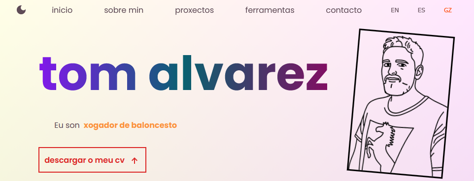

# Portfolio

https://tomalvarez.xyz

A responsive personal portfolio site built as one of the final Odin Project projects.

## SCREENSHOT

## REQUIREMENTS

The goal was to build something that showcases my front-end skills while staying true to a design philosophy of simplicity and accessibility — but with a playful and characterful edge rather than a generic dev portfolio look. What started as a single-page app evolved as usability considerations shaped the structure. Good design is iterative, and this project evolved many times as I learned more via study and user-testing.

Beyond layout and responsiveness, the site features dark and light mode switching and a language selector covering English, Spanish, and Galician — all managed through React state. These additions reflect both the reality of my life navigating three languages and cultures, and a genuine interest in building interfaces that work for different people in different contexts.

Accessibility was a core commitment throughout, not an afterthought. The site targets WCAG AA compliance, with attention to contrast ratios, semantic HTML, and keyboard navigability.

The site works across all screen sizes from 320px to 1920px wide, with distinct layouts for mobile, tablet, and desktop viewports. Built with React and Vite, styled with CSS, and deployed via GitHub Pages with a custom domain through Porkbun.

## BUILT WITH

  
